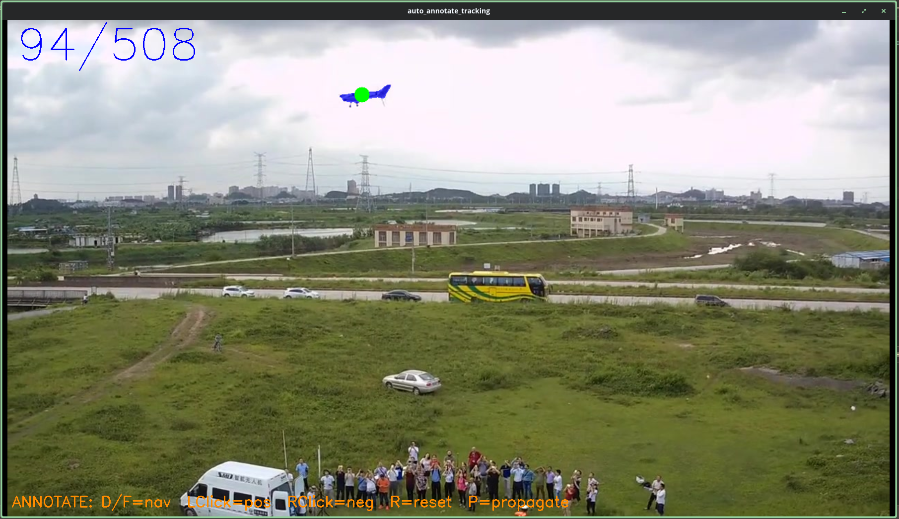
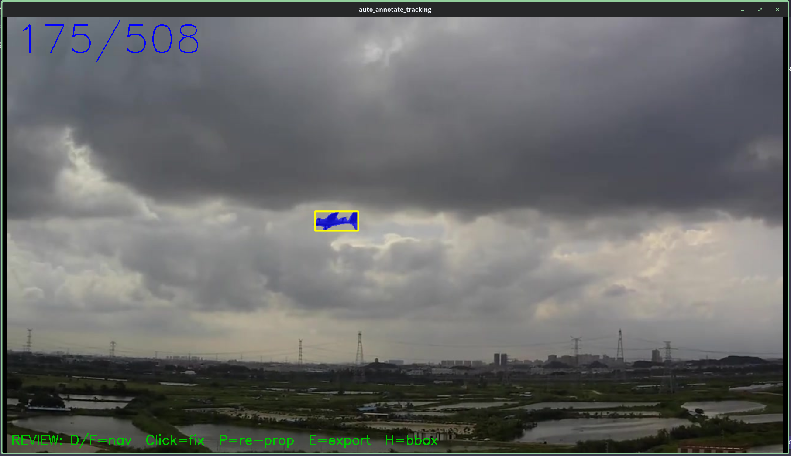

# Auto Annotate Tracking

Semi-automatic video annotation tool using SAM2. Annotate one frame, propagate the mask across all frames, review and correct, then export a YOLO-format dataset.




## Workflow

1. Place video files in the `videos/` folder
2. Run `python main.py`
3. Select a video, enter a dataset name and frame stride
4. Annotate the object on the first frame with left/right clicks
5. Press `P` to propagate the mask across all frames
6. Review and correct frames, then press `P` again to re-propagate
7. Press `E` to export the dataset to `datasets/<name>/`

## Keyboard Shortcuts

### Annotate mode

| Key | Action |
|-----|--------|
| `D` / `F` | Previous / Next frame |
| `LClick` | Add positive point (include region) |
| `RClick` | Add negative point (exclude region) |
| `R` | Reset points on current frame |
| `P` | Propagate mask across all frames |
| `Q` | Quit |

### Review mode (after propagation)

| Key | Action |
|-----|--------|
| `D` / `F` | Previous / Next frame |
| `LClick` | Add positive correction point |
| `RClick` | Add negative correction point |
| `P` | Re-propagate with corrections |
| `H` | Toggle bounding box display |
| `E` | Export dataset to `datasets/<name>/` |
| `Q` | Quit |

## Output Structure

```
datasets/
  <name>/
    images/  train/  val/  test/
    labels/  train/  val/  test/
    <name>.yaml
```

## Dataset Split

- **Train** 70%, **Val** 15%, **Test** 15%
